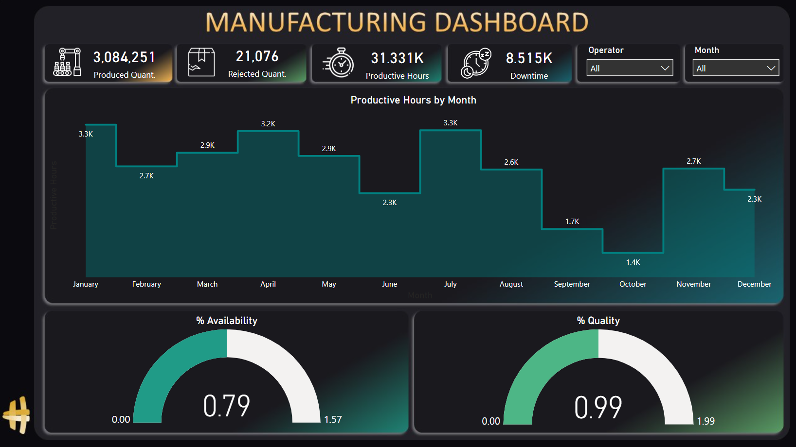
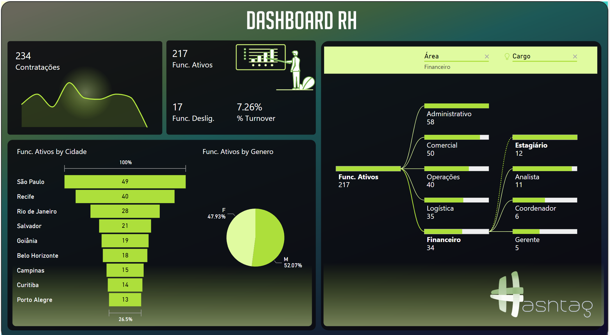
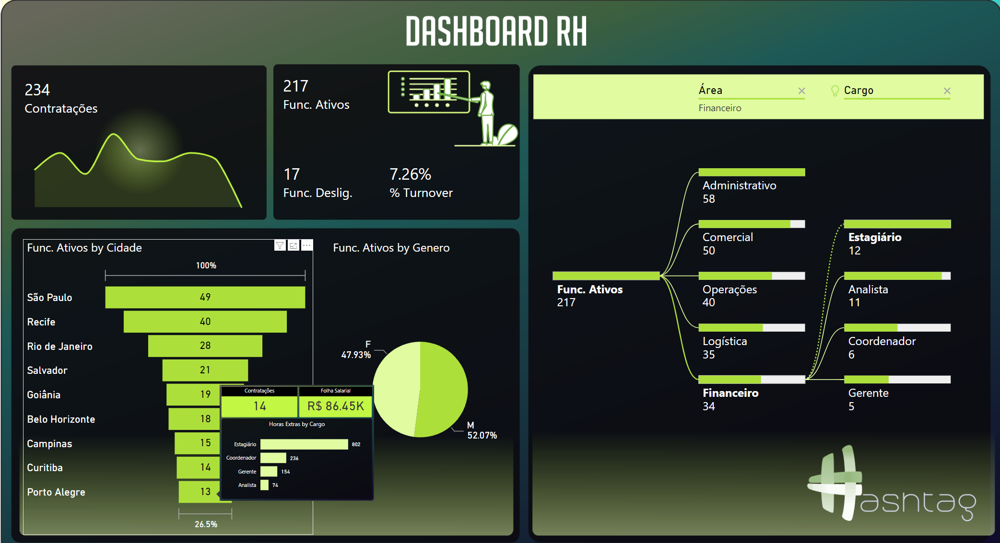

# PowerBI-Dashboards
* [Dashboard de Ventas](#sales)
* [Dashboard de Producción](#manufacturing)
* [Dashboard de RH](#rh)
* [Dashboard Financero](#financial)
* [Recursos](#referencias)

---

<h2 align="center" class="sales">Dashboard - Sales (Ventas)</h2>


Visualización interactiva de datos que muestra información sobre la parte de ventas de produtos. Tomé un archivo de Excel con más de 2000 filas que contenía columnas de:

- fecha
- producto
- categoría
- precio unitario
- costo unitario
- marca
- cantidad de ventas
- país y continente en una misma columna
- nombre del cliente con el apellido separado por una coma del primer nombre.

Utilizando <b>Power Query</b>, eliminé una columna vacía, ajusté el nombre del cliente con 'split column' para separarlo en dos columnas de país y continente utilizando 'Column from Example', y creé una nueva columna utilizando 'add column multiply' para calcular el total de facturación.

El objetivo principal de este tablero era mostrar el total de facturación, los productos más vendidos (Top N 1), la facturación por marca y la facturación por mes.

## Dashboard - Manufacturing (Producción)

El Panel de Producción ofrece una serie de métricas fundamentales para análisis y toma de decisiones eficientes. Las principales métricas incluidas son:

Horas Productivas: Esta métrica registra el total de horas en que la producción estuvo activa y operacional, incluyendo el tiempo de funcionamiento de las máquinas y la actividad del equipo de producción.

Horas Paradas: A través de una medida específica, se registran las horas en que la producción fue interrumpida, lo que posibilita la identificación de las causas y la búsqueda de soluciones para minimizar el tiempo de inactividad.

Horas de Disponibilidad: Esta medida se calcula a partir de la información de "Horas Productivas" y "Horas Paradas", proporcionando una visión clara del tiempo neto de producción y su efectiva utilización.

Cantidad Producida: Con base en una medida personalizada, se registra el número total de unidades o productos fabricados durante el período analizado, facilitando el seguimiento de la productividad.

Cantidad Rechazada: Utilizando medidas específicas, se registran las unidades o productos rechazados durante la producción, lo que permite el análisis de los factores que afectan la calidad.

Calidad: Esta métrica compleja fue creada para evaluar la excelencia de los productos fabricados, incluyendo tasas de defectos y otras informaciones relevantes para garantizar la calidad de los productos entregados a los clientes.

El panel cuenta con dos filtros que permiten el análisis de los datos de acuerdo con el operador responsable y el mes específico. Esto proporciona una visión segmentada y detallada del desempeño de la producción, permitiendo identificar variaciones y tendencias a lo largo del tiempo y entre diferentes operadores.

Para visualizar las horas productivas por mes, se ha creado un gráfico de área, que posibilita la observación de las variaciones en el tiempo de producción a lo largo de los meses. Además, se han incluido dos gráficos "speedy" para presentar porcentajes importantes: la disponibilidad (horas productivas / horas trabajadas) y la calidad (cantidad producida / cantidad producida + cantidad rechazada). Estos gráficos facilitan que el equipo de gestión comprenda la eficiencia del tiempo de producción y la eficacia general en relación a la calidad.
## Dashboard - RH
El Dashboard de Recursos Humanos presenta información crucial sobre el desempeño del equipo de colaboradores de la empresa, siguiendo una lectura en Z para una mejor comprensión. La disposición de la información comienza con los números generales que indican el total de contrataciones, el número de empleados activos y el total de empleados desvinculados. La tasa de rotación se calcula con base en estos datos.



El número de Empleados Activos se obtiene mediante una fórmula que cuenta el total de registros en la tabla "BaseFuncionarios" en la que la fecha de despido está en blanco, es decir, solo se consideran los empleados que aún están empleados.

```
Func. Ativos = CALCULATE(
    COUNTROWS(BaseFuncionarios), 
    BaseFuncionarios[Data de Demissao]=BLANK()
    )
```

El número de Empleados Desvinculados, por otro lado, se obtiene utilizando una fórmula que cuenta el total de registros en la tabla "BaseFuncionarios" en la que la fecha de despido no está en blanco, identificando así a los colaboradores que han sido despedidos de la empresa.

```
Func. Desligados = CALCULATE(
    COUNTROWS(BaseFuncionarios),
    BaseFuncionarios[Data de Demissao]<>BLANK()
)

```

La tasa de Rotación, que indica la proporción de empleados que han dejado la empresa, se calcula dividiendo el número de Empleados Desvinculados por el total de Contrataciones.

```
% Turnover = BaseFuncionarios[Func. Desligados]/[Contratações]
```

El gráfico de embudo representa el porcentaje de empleados activos en relación con diferentes ciudades, mientras que el gráfico circular muestra la distribución por género.


Además, para hacer el dashboard más dinámico e interesante, se han implementado tooltips, que son información presentada en formato gráfico cuando el cursor se coloca sobre el gráfico de embudo y el gráfico circular. Esta interacción con los gráficos permite una mejor visualización de los datos y facilita el análisis de los resultados.



El gráfico de Contrataciones se presenta como un Sparkline, un tipo de gráfico personalizado adquirido, que muestra las contrataciones a lo largo de los años. Esta representación visual ayuda a identificar patrones y tendencias a lo largo del tiempo.

El gráfico de Árbol de Empleados Activos es una representación visual única e interactiva que muestra la estructura jerárquica de los empleados activos en la empresa. Muestra de manera clara la relación entre diferentes áreas y los cargos ocupados por los colaboradores.

El diseño del dashboard ha sido cuidadosamente diseñado basándose en investigaciones en sitios web como Pinterest y Dribbble, buscando inspiración para crear una interfaz visual atractiva e intuitiva para los usuarios.

En general, este Dashboard de Recursos Humanos ofrece una visión integral y detallada de la información esencial para la gestión de los colaboradores de la empresa, lo que ayuda en la toma de decisiones estratégicas y mejora del rendimiento organizacional.

## Dashboard - Financial

<h2 align="center" class="referencias">Recursos</h2>

- PowerPoint - Para crear backgrounds
- PicPick - Herramienta similar a una pipeta, para visualizar y seleccionar colores de manera precisa
- [Color-hex](https://www.color-hex.com/) - Para buscar cores
- [Color-Space](https://mycolor.space/?hex=%23000000&sub=1) - Para combinar cores
- [Flat Icon](https://www.flaticon.com/) - Para buscar icones
